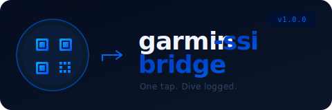

<p align="center">
  
</p>

<p align="center">
  <strong>Tired of manually re-entering every dive into the SSI app just to get your certification signed off?</strong><br/>
  So was I. So I built this.
</p>

<p align="center">
  <a href="#how-it-works">How it works</a> ·
  <a href="#hardware">Hardware</a> ·
  <a href="#getting-started">Getting started</a> ·
  <a href="#project-structure">Project structure</a>
</p>

---

## The problem

The Garmin MK3i is an exceptional dive computer. The SSI app is where your dives get logged for certification. These two things do not talk to each other.

Garmin shut down their SSI API in 2023. The only remaining path is:

1. Open Garmin Dive app
2. Find the dive
3. Note down depth, time, temperature, gas mix...
4. Open SSI app
5. Tap through a dozen fields
6. Submit

Every. Single. Dive.

## The solution

**garmin-ssi-bridge** turns that into:

1. Plug in USB cable → device boots
2. Hold phone to device → PWA opens automatically (NFC)
3. In Garmin app: export dive as FIT → tap **Garmin SSI Bridge**
4. Done — QR code appears on the display, scan it with SSI app ✅

One tap. Everything pre-filled. No typing.

---

## How it works

```
┌─────────────┐   FIT file    ┌──────────────────┐   SSI string   ┌─────────────┐
│  Garmin MK3i │ ──────────→  │  PWA (Chrome)     │ ─────────────→ │  ESP8266    │
│  Dive App    │  share sheet  │  parses FIT       │   WebUSB/CH340  │  + GC9A01   │
└─────────────┘               │  builds SSI string │               │  QR display │
                               └──────────────────┘               └──────┬──────┘
                                                                          │ scan
                                                                   ┌──────▼──────┐
                                                                   │   SSI App   │
                                                                   └─────────────┘
```

- **PWA** — no installation needed, just a URL. Opens automatically via NFC sticker on the device.
- **FIT parser** — reads Garmin's binary dive log format directly, extracts depth, duration, temperatures.
- **SSI string builder** — generates the exact QR payload the SSI app expects (reverse-engineered from real MK3i exports).
- **ESP8266 + GC9A01** — receives the string over WebUSB and renders a QR code on a 1.28" round display.

---

## Hardware

| Part | Role | Notes |
|---|---|---|
| ESP8266-12F | MCU | Runs QR rendering firmware |
| CH340C | USB-Serial bridge | Soldered on custom PCB |
| GC9A01 1.28" TFT | QR display | 240×240 round, fits in inscribed square |
| NTAG213 NFC sticker | Auto-open PWA | One tap → Chrome opens app |
| USB-C port | Power + data | Single cable workflow |

Custom PCB — KiCad files in [`hardware/pcb/`](hardware/pcb/).  
3D-printed enclosure (ASA body, PETG bezel, TPU seal) in [`hardware/3d-prints/`](hardware/3d-prints/).

---

## Getting started

### 1. Deploy the PWA

Upload the contents of [`software/pwa/`](software/pwa/) to GitHub Pages (or any HTTPS host):

```bash
# Enable GitHub Pages in your repo settings → Pages → Source: main
# App will be available at https://YOUR_USER.github.io/garmin-ssi-bridge/
```

### 2. Flash the ESP

```bash
# Arduino IDE
# Board: Generic ESP8266 Module
# Libraries: TFT_eSPI (Bodmer), qrcode (ricmoo)
# Copy software/esp/User_Setup.h into your TFT_eSPI library folder
# Flash software/esp/firmware.ino
```

### 3. First-time app setup

1. Open the PWA → **⚙ Settings**
2. Tap **Scan SSI profile QR** → point camera at your SSI app profile QR code
3. Tap **Write NFC tag** → hold NTAG213 sticker to phone → stick it on device housing

### 4. Every dive after that

1. Plug in USB → ESP boots
2. Hold phone to NFC sticker → PWA opens
3. Garmin app → dive → `···` → **Export as FIT** → tap **Garmin SSI Bridge**
4. Scan QR with SSI app ✅

---

## Project structure

```
garmin-ssi-bridge/
├── software/
│   ├── esp/                  ESP8266 Arduino firmware
│   │   ├── firmware.ino      QR rendering + serial protocol
│   │   └── User_Setup.h      TFT_eSPI pin config for GC9A01
│   └── pwa/                  Progressive Web App
│       ├── index.html        App shell
│       ├── app.js            Share intent, USB, NFC, QR display
│       ├── fit-parser.js     Garmin FIT binary parser
│       ├── ssi-builder.js    SSI QR string builder
│       ├── usb-serial.js     WebUSB CH340 communication
│       ├── sw.js             Service worker (offline + share target)
│       └── manifest.json     PWA manifest
└── hardware/
    ├── pcb/                  KiCad schematic + layout
    └── 3d-prints/            Enclosure STL files
```

---

## SSI QR format

Reverse-engineered from a real Garmin MK3i export. No official documentation exists.

```
dive;noid;dive_type:0;divetime:27.0;datetime:202604051740;depth_m:20.1;
site:83913;var_weather_id:1;var_entry_id:35;var_water_body_id:52;
var_watertype_id:4;var_current_id:6;var_surface_id:10;var_divetype_id:24;
user_master_id:123456;user_firstname:Max;user_lastname:Muserman;
user_leader_id:;watertemp_c:25.0;airtemp_c:24.0;vis_m:20.0;watertemp_max_c:26.0
```

Get your `user_master_id` once via [takken.io](https://takken.io/tools/garmin-to-ssi-dive-log-helper) — the app stores it from then on.

---

## Ordering

- **PCB** — see [`hardware/pcb/`](hardware/pcb/) for JLCPCB / PCBWay Gerber export instructions
- **Enclosure** — see [`hardware/3d-prints/`](hardware/3d-prints/) for print settings, or order via [PCBWay Community](https://www.pcbway.com/project/)

---

## Browser support

Chrome on Android is required for WebUSB, Web NFC, and the share target.  
All other browsers fall back to mock mode — QR is displayed directly on the phone screen.

---

## License

MIT — do whatever you want with it. If you improve the FIT parser or find new SSI fields, PRs are very welcome.
